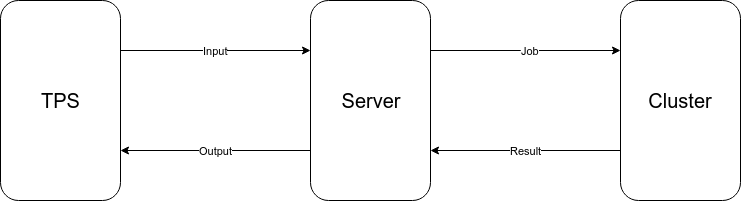
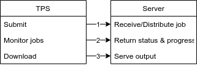
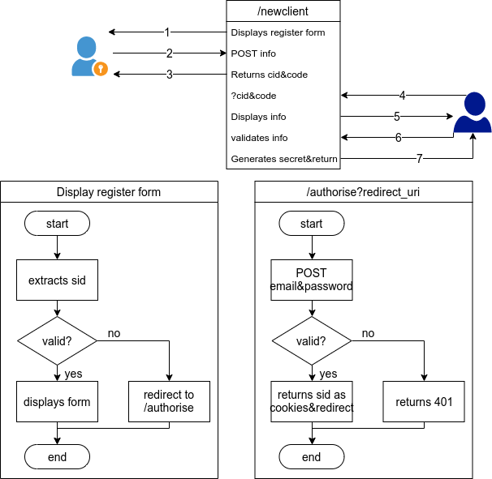

# MC
Server at MC Cluster
# Author
Xiao Zhang
# Motivation
The system is designed for cloud computing.
# Design
The system acts as a bridge between TPS and MC.

The 4 connections are based on HTTP protocol. Therefore it is natural to choose Express.js as the framework of the server.
## Data Flow
At present only the dataflow between TPS and Server is designed.

The web resources and internal structure of the system is illustrated above. There are 3 types of endpoints open to TPS.

The dataflow is shown above. Step 1, 2 and 3 are conducted using HTTP POST/GET methods.

Now each step above is described below.
### 1
The input file is created by TPS. with a call to submit function, TPS should upload the data in a form through POST(/newjob). The server then stores the input.
- Data Type
  - **ID:** INT
  - **INPUT:** FILE
- Data Lifecycle

  The lifespan of the data uploaded is indefinite. Therefore the data is stored in a central database.
### 2
When the monitor function in TPS fires its request(/monitor?id[]=\*\*)

- Data Type

  The data returned to the client is encoded in a JSON array with id, status, start\_date and est\_date.
- Data Lifecycle

  The data is used by TPS immediately and discarded at once.
### 3
When the status of a job shows that it can be downloaded, an endpoint for the job(/id) is created for TPS to download the output file.
- Data Type

  The data created in this stage is the endpoint of the output file. 
- Data Lifecycle

  The file is kept for at most 14 days from the moment of its creation. After its deletion, the status of the job is changed accordingly.

## Security
The system communicates across internet therefore the security is an issue. The basic authorisation&authentication process requires management of user and resource. Here is the definition:
- **User:** people use/manage resources
- **Resource:** endpoints on this site

### User
According to the use cases, user is divided into 2 levels, each with different permissions
1. Administrator of the website&HPC
2. Entities using the resources

The administrator has full control over the website and HPC. The common users have access to the calculation resources.

### Resource
Described in previous section

### Workflow

The authorisation process:

The registration process:

